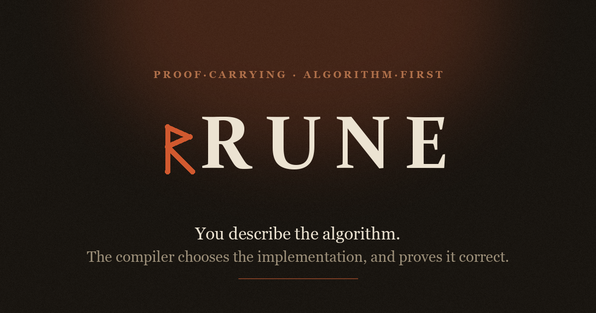

<p align="center">
  <a href="https://tharun99856.github.io/rune/">
    
  </a>
</p>

<p align="center">
  <a href="https://github.com/tharun99856/rune/actions/workflows/ci.yml"></a>
</p>

**▶ Try it in your browser: https://tharun99856.github.io/rune/** — the real
optimizer, running as Python via Pyodide, no install.

**You describe the algorithm. The compiler chooses the implementation — and
proves it correct.**

Rune is a small language whose keywords are *intents* (group, order, take,
explore, maximize), not implementation details. You never pick a heap vs. a
sort, or BFS vs. Dijkstra. You state what you want; the optimizer recognizes
the shape of the problem and selects the algorithm, then verifies its choice
against the naive baseline.

```rune
GROUP nums BY value
COUNT EACH group
ORDER BY count DESC
TAKE 10
```

## The one thing that makes Rune Rune

It makes three *structurally different kinds* of optimization decision across
three unrelated algorithm families — and that's the whole point. Not one
clever rewrite; a repeatable principle.

```
python -m rune.cli proofs
```

```
1. TOP_K   -- decision made at COMPILE TIME, from the syntax pattern
   intent:   GROUP...COUNT...ORDER BY count DESC / TAKE 3
   decision: TOP_K(count, 3) -- a heap of size k, not a full sort
   verified: True

2. BFS vs Dijkstra -- decision made at RUNTIME, from the actual data
   intent:   EXPLORE graph FROM a   (same source both times)
   unweighted data -> BFS   weighted data -> Dijkstra
   verified: True

3. Kadane  -- decision made from the OBJECTIVE's structure
   intent:   MAXIMIZE SUM OVER CONTIGUOUS nums
   decision: KADANE(maximize) -- O(n) single pass, not O(n^2)
   verified: True
```

Every line is produced by the real optimizer and self-checked against the
naive baseline before printing — a `MISMATCH` shows instead of a
plausible-looking wrong number if anything ever disagrees. At scale the
Kadane rewrite is ~1090x (O(n²)→O(n)); `python -m rune.cli complexity` shows
real measured time and space. All three plans also compile to **native C++**
(`rune/backends/cpp_backend.py`, via a pip-installed `zig` toolchain — no
system compiler needed), each verified equal to the interpreter.

## AI proposes, Rune proves

This is where the closed-and-provable design pays off. An LLM can emit a Rune
program — confidently, and sometimes wrong. Rune is the deterministic source
of truth that certifies it or rejects it with a precise reason, no model
involved (`python -m rune.cli verify`):

```
[VERIFIED] a correct proposal
   proposed: MAXIMIZE SUM OVER CONTIGUOUS nums
   result:   6
   chose:    KADANE(maximize) -- O(n) single pass

[REJECTED] a hallucinated proposal (keyword that doesn't exist)
   rejected at [parse]: unrecognized step starting with 'FILTER'

[REJECTED] a plausible proposal with a WRONG claimed answer
   rejected at [expected]: produced 6, expected 99
```

An LLM wrapper *generates* code and hopes. Rune *proves* it — catches
hallucinated syntax and wrong claimed outputs deterministically. The AI is
just a proposer; the compiler is the judge. (The English→Rune LLM front-end is
a thin layer you add with your own API key; the verification engine here needs
neither.)

## What Rune deliberately is NOT

Rune is **closed and provable, not general.** It expresses a specific slice of
algorithmic work extremely well; it does **not** try to solve every DSA
problem. Optimization over a *predicate-defined* space (much of classic DP —
Coin Change, Edit Distance, "subsets summing to X") is a documented, permanent
ceiling: expressing it needs arbitrary predicates, which would destroy the
exact property that lets the optimizer reason at all. That trade — narrow but
provable, over broad but redundant — is the founding decision
(`docs/language/decisions/DECISIONS.md`). A language that does everything
already exists; a language that proves your algorithm choice does not.

## Status

Six concepts, frozen and evidence-driven (`GROUP`, `COUNT`, `ORDER`, `TAKE`,
`EXPLORE`, `MAXIMIZE`/`MINIMIZE`) — each earned by testing against 100 real
problems, not decreed. Three optimizer proofs, and **all three now compile to
native C++** — the optimized plan is generated as C++, compiled with a real
clang toolchain (`zig`, no system compiler needed), run, and verified equal to
the reference interpreter. Backends sit behind a common interface (Python
interpreter, LLVM-JIT via Numba, native C++). Measured ~5x native over
interpreted on Kadane at 5M elements, same answer. ~87 tests, including ones
that compile and run real C++ on every run. See `docs/language/V0.1_FREEZE.md`
for how the vocabulary was frozen and what got promoted since.

## Documentation

- `docs/language/grammar/current.md` — exactly what the parser accepts today.
- `docs/language/philosophy/style-laws.md` — the design laws, each derived
  from testing against real examples, not decreed up front.
- `docs/language/atlas/algorithm-atlas.md` — problems tested against the
  frozen grammar, and what each one reveals (or doesn't) about what's missing.
- `docs/language/primitives/` — why each existing concept/keyword exists;
  `docs/language/primitives/candidates/` — open capability questions, named
  after the capability, never a presumed keyword spelling.
- `docs/language/decisions/DECISIONS.md` — why things are the way they are.

## Running the tests

```
python -m pytest
```
